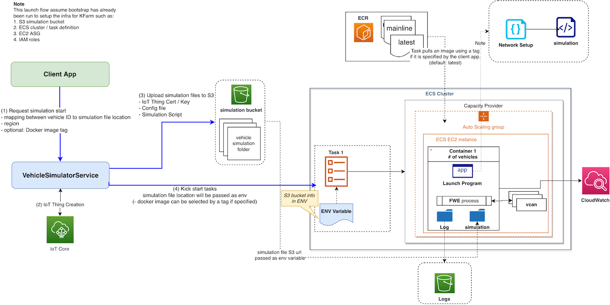

#Vehicle Simulator
##Introduction
Vehicle Simulator is a Kotlin package providing AWS IoT FleetWise Edge Agent and Vehicle
simulation solution on AWS platform. 

This package can either be used as local command line application to launch simulation from terminal or
imported as Kotlin library into other cloud application such as CI/CD, canary. 

While the EC2 serve as the foundation of running virtual vehicle and edge agent, AWS ECS is used to make
the simulation scalable and robust.
The following diagram illustrates the vehicle launch process.



##Development
###Setup
```
brazil ws create --name vehicle-simulator
cd vehicle-simulator
brazil ws use \
  --versionset IoTAutobahnVehicleSimulator/development \
  --platform AL2_x86_64 \
  --package IoTAutobahnVehicleSimulator
cd src/IoTAutobahnVehicleSimulator
brazil-build
```

##CLI User Guide
## Pre-requisite
### On-boarding
#### CDK to deploy AWS resources
For first time use, please run CDK to deploy AWS resources.
The CDK instruction can be found in readme [IoTAutobahnVehicleSimulatorCDK](https://code.amazon.com/packages/IoTAutobahnVehicleSimulatorCDK/trees/mainline)
#### Pull Edge Docker Image from AWS ECR
To use the default Edge docker image, the AWS account needs to have access to the two ECRs hosted on account 
iot-autobahn+embedded-code@amazon.com 763496144766 : 
[vehicle-simulator-arm64](https://tiny.amazon.com/vdhs5utm/IsenLink) and [vehicle-simulator-amd64](https://tiny.amazon.com/ly1sl76q/IsenLink).

There are two ways of getting access to ECR. The first approach is the quickest.
* Add your account under internal developer service principal: 
[developer.iot-autobahn.aws.internal](https://naps.amazon.com/service_principals/148728)
* Log into each ECR through Isengard, go to Permissions. Click on Edit to add your AWS account.

### Refresh AWS credential
Example
```
ada credentials update --account 763496144766 --role Admin --once
```

## Simulation Input Json 
User can pass simulation input as json file. The simulation input allows user to define vehicle IDs, S3 bucket/keys,
FleetWise edge config file local path, simulation scripts local path. Vehicles can have different S3 buckets as long
as User ensure test account have write-access.
to the S3 buckets at the region.

Below is the example json 
```
[
  {
    "simulationMetaData": {
      "vehicleID": "car0",
      "s3": {
        "bucket": "bucket0",
        "key": "car0"
      }
    },
    "edgeConfigFilename": "test/car0/config.json",
    "simulationScriptPath": "car0/sim"
  },
  {
    "simulationMetaData": {
      "vehicleID": "car1",
      "s3": {
        "bucket": "bucket1",
        "key": "car1"
      }
    },
    "edgeConfigFilename": "test/car1/config.json",
    "simulationScriptPath": "car1/sim"
  }
]
```

In some cases, you may not wish to provision a new thing for every vehicle or associate them with device certificates
created in IoT Core. For example, the certificate is issued via private CA (eg. ACM PCA), and you wish to provision via 
[JITR (Just-In-Time Registration)](https://aws.amazon.com/blogs/iot/just-in-time-registration-of-device-certificates-on-aws-iot/).

In this case, you can set ```provisionThing``` to false and provide device certificate config.
Device certificate config consists of a CA ARN set up in ACM PCA and other certificate parameters used to create a device certificate
signed by the private CA created in ACM.

```
[
  {
    "simulationMetaData": {
      "vehicleID": "car1",
      "s3": {
        "bucket": "bucket1",
        "key": "car1"
      },
      "provisionThing": false,
      "deviceCertificateConfig": {
        "caArn": "arn:aws:acm-pca:eu-central-1:670453324271:certificate-authority/6d13e80b-43af-48f2-8052-61f85ab7f9d4,
        "commonName": "car1",
        "organization": "Amazon",
        "countryCode": "US"
      }
    },
    "edgeConfigFilename": "test/car1/config.json",
    "simulationScriptPath": "car1/sim"
  }
]
```

Vehicle Simulator will
take this input and create IoT Things, compose config file and upload the whole package to the S3 bucket.
The S3 bucket would contain the following folder structure after prelaunch.
```
S3
    |_ vehicle folder
        |_ pri.key
        |_ cert.crt
        |_ config.json
        |_ sim
            |_ simulation scripts

```

## Create Vehicles 

Use command `LaunchVehicles` with the following options. Highlight in bold are required options.
* **--simulation-input, -s**: a json file to specify
* **--region, -r**: specify aws region for resources such as S3 bucket, EC2, ECS
* **--stage**: FleetWise test stage: alpha, beta, gamma, prod
* --cpu-architecture, -arch: FleetWise Edge agent cpu architecture: arm64, amd64. Default is arm64
* --tag, -t: tags user can customize to tag on ECS tasks
* --recreate-iot-policy: flag to specify whether re-create or reuse IoT Policy if exists. Default is no
* --ecs-task-definition: ECS task definition name
* --ecs-waiter-timeout: ECS Timeout in unit of minutes before application gives up on waiting for all tasks running.
* --ecs-waiter-retries: ECS retries before application gives up on waiting for all tasks running.

Example:
```
brazil-runtime-exec vehicle-simulator LaunchVehicles \
 -r us-west-2 \
 -s simulation_input.json \
 --tag user someone testID xyz \
 -a arm64 \
 --recreate-iot-policy \
 --stage gamma \
 --ecs-task-definition fwe-arm64-with-cw
```

## Stop Vehicles
Use command `StopVehicles` with the following options. Highlight in bold are required options.
* **--region, -r**: specify aws region for resources such as S3 bucket, EC2, ECS
* --ecsTaskID: ECS task IDs to be stopped. If not supplied to command, command will not stop ECS task
* --simulation-input, -s: a json file to specify simulation input. If not supplied to command, command will not delete IoT Things and S3 bucket
* --cpu-architecture, -a: FleetWise Edge agent cpu architecture: arm64, amd64. Default is arm64
* --delete-iot-policy: flag to specify whether delete iot policy. Default is yes
* --delete-iot-certificate: flag to specify whether delete iot cert. Default is yes
* --ecs-waiter-timeout: ECS Timeout in unit of minutes before application gives up on waiting for all tasks stopped.
* --ecs-waiter-retries: ECS retries before application gives up on waiting for all tasks stopped.

Example:
```
brazil-runtime-exec vehicle-simulator StopVehicles \
 -r us-west-2 \
 --ecsTaskID task1 task2 \
 -s simulation_input.json \
 --delete-iot-policy \
 --delete-iot-certificate
```
